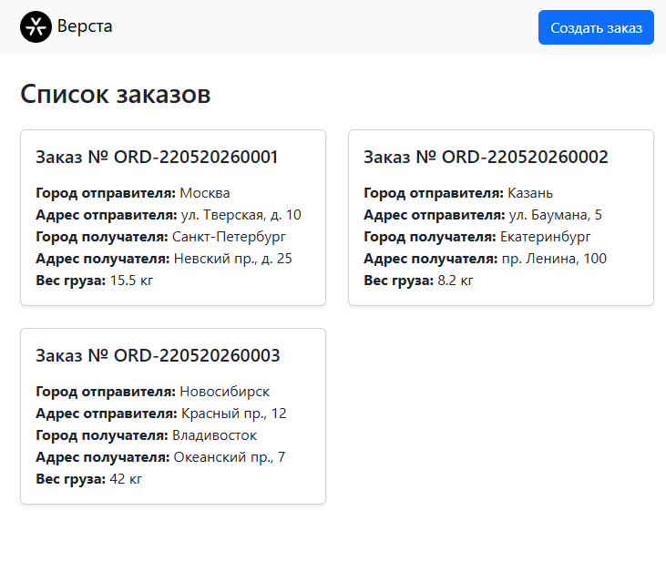
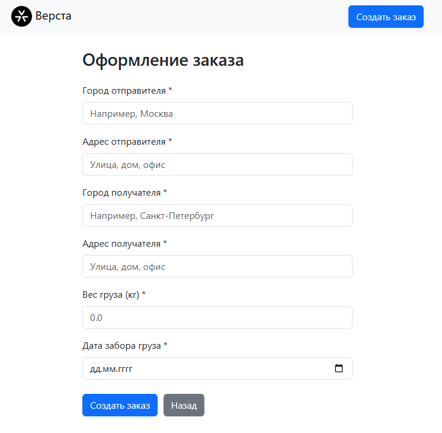
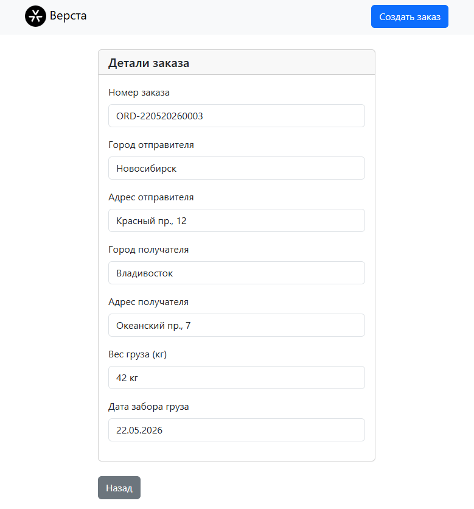

Веб приложение для работы с заказами.
Спроектировал и разработал Туров Андрей.
Стэк: ASP.NET 9, PostgreSql, React js.

Если у вас установлен Docker:
1) Перейдите в директорию проекта
2) Запустите команду "docker compose up -d"
2) Перейдите по ссылке "http://localhost:3000/"
3) Используйте веб-приложение !

Если не установлен Docker:
1) Необходимо запустить проект ASP.NET VerstaOrders через любую IDE
2) Перейдите в директорию versta-client
3) Запустите команду "npm install"
4) Запустите команду "npm run dev"
5) Перейдите по ссылке "http://localhost:5173/"
6) Используйте веб-приложение !

Скриншоты:

